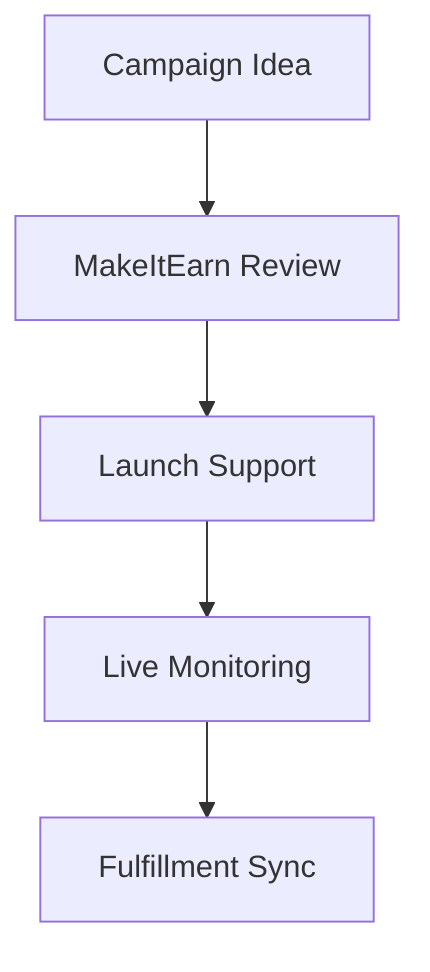

## Overview

MakeItEarn provides seamless integrations with leading e-commerce platforms. You connect your accounts to access expert setup, optimization tools, and automated workflows. These integrations help you launch stores faster, optimize listings, and manage campaigns efficiently.

<Columns cols={3}>
  <Card title="Shopify" icon="shopping-cart" href="#shopify-integration">
    Set up and customize your online store with guided templates.
  </Card>
  <Card title="Amazon" icon="package" href="#amazon-optimization">
    Optimize seller accounts for higher visibility and sales.
  </Card>
  <Card title="Kickstarter" icon="funding" href="#kickstarter-support">
    Get campaign support from launch to fulfillment.
  </Card>
</Columns>

<Callout kind="tip">
  Start with your primary platform. MakeItEarn syncs data across all connected services automatically.
</Callout>

## Shopify Store Setup Integration

Connect MakeItEarn to your Shopify store for automated theme installation, product import, and performance monitoring.

### Quick Setup Steps

<Steps>
  <Step title="Create API Key" icon="key">
    Log in to your MakeItEarn dashboard at `https://dashboard.makeitearn.com`. Navigate to Integrations > Shopify and generate an API key.
  </Step>
  <Step title="Install App" icon="download">
    In Shopify admin, add the MakeItEarn app from the App Store. Paste your `{API_KEY}` during setup.
  </Step>
  <Step title="Sync Products" icon="sync">
    Trigger initial sync. MakeItEarn imports up to 1,000 products in `<5` minutes.
  </Step>
</Steps>

For custom webhooks, use this configuration:

<CodeGroup tabs="JavaScript,Python">
  ```javascript
  const webhookUrl = 'https://api.makeitearn.com/webhooks/shopify';
  fetch(webhookUrl, {
    method: 'POST',
    headers: { 'Authorization': `Bearer ${YOUR_API_KEY}` },
    body: JSON.stringify({ event: 'product.updated' })
  });
  ```
  ```python
  import requests
  webhook_url = 'https://api.makeitearn.com/webhooks/shopify'
  headers = {'Authorization': f'Bearer {YOUR_API_KEY}'}
  requests.post(webhook_url, json={'event': 'product.updated'}, headers=headers)
  ```
</CodeGroup>

## Amazon Seller Account Optimization

Link your Amazon Seller Central to MakeItEarn for inventory syncing, pricing rules, and PPC campaign management.

<Tabs>
  <Tab title="Basic Connection" icon="link">
    Generate OAuth token in Seller Central. Enter it in MakeItEarn dashboard under Amazon integration.
  </Tab>
  <Tab title="Advanced Rules" icon="settings">
    <Expandable title="Pricing Automation" default-open="true">
      Set rules like `{price > competitor_price * 1.1}` for dynamic adjustments.
    </Expandable>
  </Tab>
</Tabs>

## Kickstarter Campaign Support

MakeItEarn assists with pre-launch planning, backer updates, and fulfillment integration post-funding.

### Campaign Workflow



<Callout kind="info">
  Connect via API for real-time backer data. Use `https://api.makeitearn.com/kickstarter/webhook`.
</Callout>

## Third-Party Tool Connections

Extend MakeItEarn with tools like Zapier, Klaviyo, or Google Analytics.

| Tool       | Connection Type | Key Benefit                  |
|------------|-----------------|------------------------------|
| Zapier    | Webhooks       | Automate workflows           |
| Klaviyo   | API Sync       | Email marketing integration  |
| Google Analytics | OAuth     | Traffic and conversion tracking |

<ParamField header="X-MakeItEarn-Key" param-type="string" required="true">
  Your API key for third-party auth.
</ParamField>

<ParamField query="platform" param-type="string" required="false">
  Specify `shopify`, `amazon`, or `kickstarter`.
</ParamField>

These integrations reduce manual work by `80%`, letting you focus on growth. Test connections in the dashboard sandbox before going live.